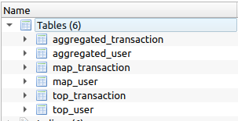

<video height = "200" src = "https://user-images.githubusercontent.com/117557948/219284713-df4c0aa8-af61-4a48-b1b5-0bd1c83aadcc.mp4"></video> 

<h1 align="center"> Phonepe_Pulse Data Visualisation using "SQLite"</h1>


## Deployment

To deploy this project run

```bash
  import streamlit as st
  from PIL import Image
  import os
  import json
  from streamlit_option_menu import option_menu
  import subprocess
  import plotly.express as px
  import pandas as pd
  import sqlite3
  import requests
```

## Cloning phonepe pulse Repository

```bash
  response = requests.get('https://api.github.com/repos/PhonePe/pulse')
  repo = response.json()
  clone_url = repo['clone_url']

  repo_name = "pulse"
  clone_dir = os.path.join(os.getcwd(), repo_name)
```
    

